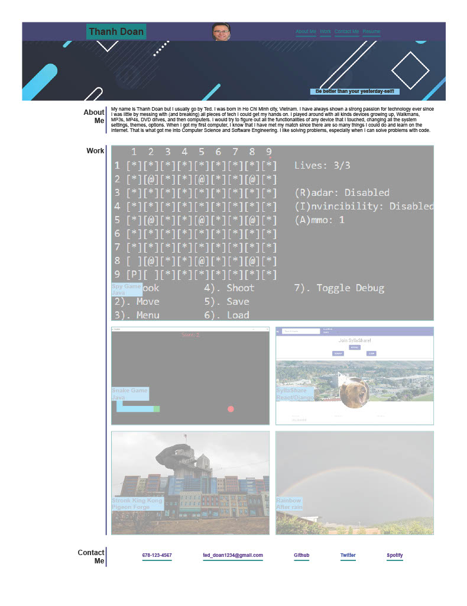

# My-portfolio
This is a landing page to my portfolio


## Description

- I want to create a professional landing page for my Portfolio that showcase my work experience, contact information and a short description about me.
- I build this project as a stepping stone to showcase my future projects for future recruiters/employers.
- I better understood the concepts and how to use CSS variables, flexbox, grid and media queries.


## Table of Contents 

- [Usage](#usage)
- [Links](#links)
- [Features](#features)
- [User Story](#user-story)
- [Acceptance Criteria](#acceptance-criteria)


## Usage


 

## Links

- Github page: https://github.com/teddysm/My-portfolio
- Deployed page:


## Features

- Nav bar links will navigate user to corresponding sections of the website (Ex: click on Work to jump to the Work section)
- Images of work projects are opaqued until hovered on
- Click on a project image to be directed to that project


## User Story

```
AS AN employer
I WANT to view a potential employee's deployed portfolio of work samples
SO THAT I can review samples of their work and assess whether they're a good candidate for an open position
```


## Acceptance Criteria

Here are the critical requirements necessary to develop a portfolio that satisfies a typical hiring manager’s needs:

```
GIVEN I need to sample a potential employee's previous work
WHEN I load their portfolio
THEN I am presented with the developer's name, a recent photo or avatar, and links to sections about them, their work, and how to contact them
WHEN I click one of the links in the navigation
THEN the UI scrolls to the corresponding section
WHEN I click on the link to the section about their work
THEN the UI scrolls to a section with titled images of the developer's applications
WHEN I am presented with the developer's first application
THEN that application's image should be larger in size than the others
WHEN I click on the images of the applications
THEN I am taken to that deployed application
WHEN I resize the page or view the site on various screens and devices
THEN I am presented with a responsive layout that adapts to my viewport
```